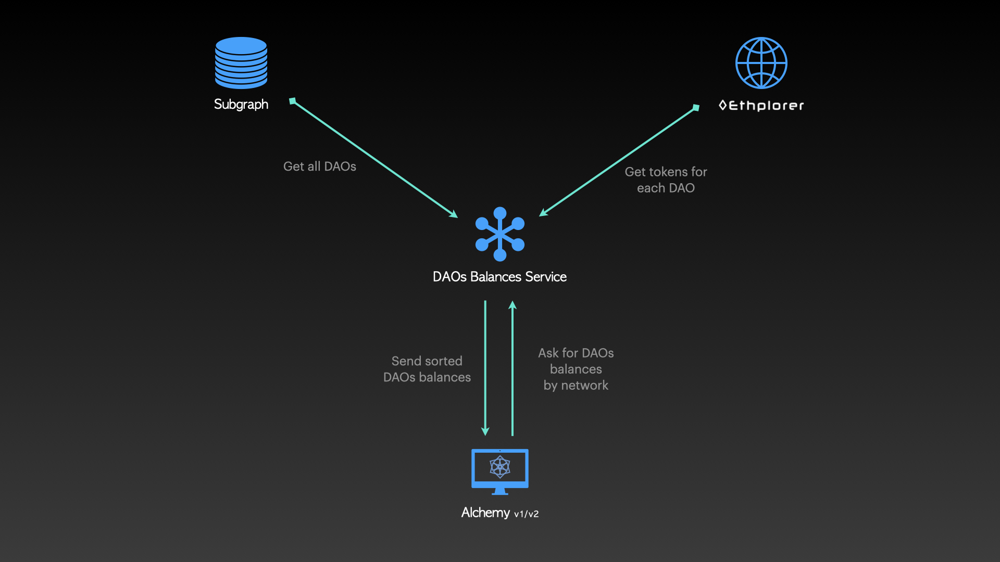

# DAOs Balances Service

A service to get a sorted DAOs total holdings (ETH + erc20) array in USD via APIs

**NOTE:** This service is still under development and testing

## Usage

The endpoint accepts 4 parameters:
- version: Alchemy version (`v1` or `v2`)
- network: `http_main` for example.
- from (optional): start selection index
- to (optional): end selection index (excluding)

*exmaple: https://daos-balances-service.herokuapp.com/daosBalance/getDaosBalances/?version=v1&network=http_main&from=0&to=20*

By default, the DAOs are sorted in descending balance order.

## Development

1. `git clone https://github.com/daostack/daos-balances.git && cd daos-balances`
2. `npm install`
3. `npm start`

The service runs on port 3001
